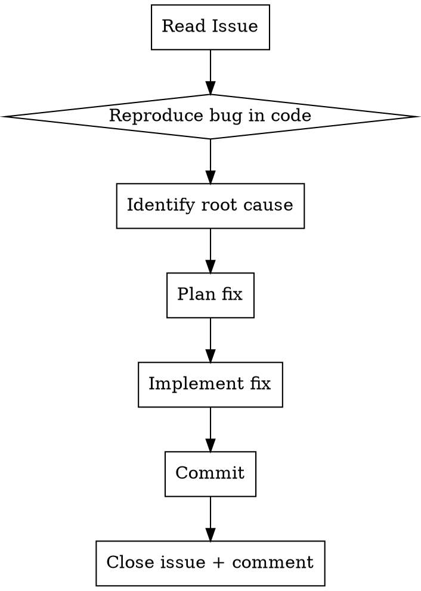

# Fix GitHub Issue Bugfix

## Overview

A systematic workflow to go from "GitHub issue reported" → "bug identified, fixed, committed, and issue closed" in one disciplined flow.

The key insight: **read the issue first, fix the root cause, close with evidence.**

## Workflow



## Script: Quick Issue Operations

A reusable script is at `skills/fix-github-issue-bugfix/scripts/github-issue.sh`.

```bash
export GITHUB_TOKEN=github_pat_xxx

# Read issue
./scripts/github-issue.sh get StarTower6/ReQCollect 1

# List open issues
./scripts/github-issue.sh list StarTower6/ReQCollect

# Close with comment
./scripts/github-issue.sh close StarTower6/ReQCollect 1 "fix: multi-select bug resolved"

# Add comment
./scripts/github-issue.sh comment StarTower6/ReQCollect 1 "Root cause found and fixed"
```

## Step-by-Step

### Step 1: Read the Issue

```bash
# With gh CLI
gh issue view 1 --json title,body,labels,state --repo owner/repo

# With curl + token (when gh CLI unavailable)
curl -s -H "Authorization: token $GITHUB_TOKEN" \
  "https://api.github.com/repos/owner/repo/issues/1"
```

Extract from the issue:
- **Title** — what's the bug about?
- **Body** — exact reproduction steps and screenshots
- **Labels** — bug/enhancement/priority

### Step 2: Find Root Cause in Code

Read the affected code files. Look for:

- **Computed properties** that create temporary copies (most common Vue bug source)
- **State mutation on derived data** rather than originals
- **Event handlers** that modify computed rather than source data

Common Vue 3 red flag:

```javascript
// ❌ BAD: State on computed shallow copy — lost on re-compute
const displayMessages = computed(() => {
  const msgs = messages.value.map(m => ({ ...m }));
  msgs[i]._selected = new Set();  // ← lost when computed re-runs
  return msgs;
});

// ✅ GOOD: State on original message object — survives re-compute
const displayMessages = computed(() => {
  const msgs = messages.value.map(m => ({ ...m }));
  const orig = messages.value[i];
  if (!orig._qrProcessed) {
    orig._selected = new Set();  // ← lives on original, not copy
  }
  msgs[i]._selected = orig._selected;  // ← reference to original
  return msgs;
});
```

### Step 3: Plan the Fix

Use the plan → generate → evaluate workflow (PGE).

The plan should include:
- Root cause (one sentence)
- What changes are needed
- Which files to modify

### Step 4: Implement + Commit

```bash
git add <files>
git commit -m "fix: description of the fix (fixes #1)"
```

Commit message format:
```
fix: <short description> (fixes #<issue-number>)

<detailed body explaining root cause and fix>
```

The `(fixes #N)` syntax auto-closes the issue when pushed.

### Step 5: Close Issue + Comment

```bash
# Close the issue
curl -s -H "Authorization: token $GITHUB_TOKEN" \
  -X PATCH "https://api.github.com/repos/owner/repo/issues/1" \
  -H "Content-Type: application/json" \
  -d '{"state":"closed"}'

# Add a comment explaining the fix
curl -s -H "Authorization: token $GITHUB_TOKEN" \
  -X POST "https://api.github.com/repos/owner/repo/issues/1/comments" \
  -H "Content-Type: application/json" \
  -d '{"body": "## 修复完成\n\n**根因:** ...\n\n**修复 (commit abc123):**\n...\n\n✅ 结果"}'
```

The comment should include:
- **根因 (Root cause)** — what was wrong
- **修复 (Fix)** — what changed and in which commit
- **结果 (Result)** — what now works

## Common Bug Patterns in Vue 3 Code

| Pattern | Symptom | Fix |
|---------|---------|-----|
| State on computed shallow copy | Toggle/selection lost on re-render | Move state to original reactive data |
| Event handler on computed copy | Click handler can't find original | Find original via reference match |
| Set used without spread trigger | Checkboxes not updating | `messages.value = [...messages.value]` |

## Common Mistakes

- **Forgetting the comment** — always explain the fix so others (and future Claude) understand
- **Not linking commit to issue** — use `(fixes #N)` in commit message for auto-close
- **Fixing symptom, not root cause** — always trace to the real why, not the surface behavior
- **No GITHUB_TOKEN** — script checks and warns; set before starting

## Real-World Example

Issue #1 中，bug 是「多选选项无法取消勾选、确认选择按钮不可点击」。

**根因:** `displayMessages` computed 通过 `.map(m => ({...m}))` 创建浅拷贝，`_qrSelected` Set 存在拷贝上。
每次 `messages.value = [...messages.value]` 触发 computed 重算 → 创建新拷贝 → 旧 Set 丢失。

**修复:** 把状态移到 `messages.value` 的原始对象上存储，computed 从原始对象读取。
